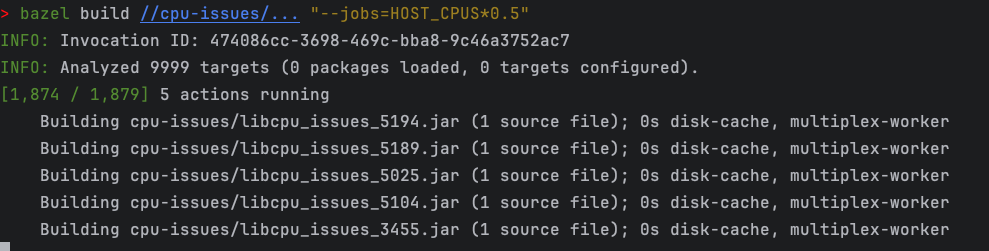

# CPU issues

You can observe on MacOS that while building this with 50% of the host CPUs, all CPUs still get pushed to 100%.
The build is 10,000 single file `java_library` targets.

```bash
bazel build //cpu-issues/... "--jobs=HOST_CPUS*0.5"
```




